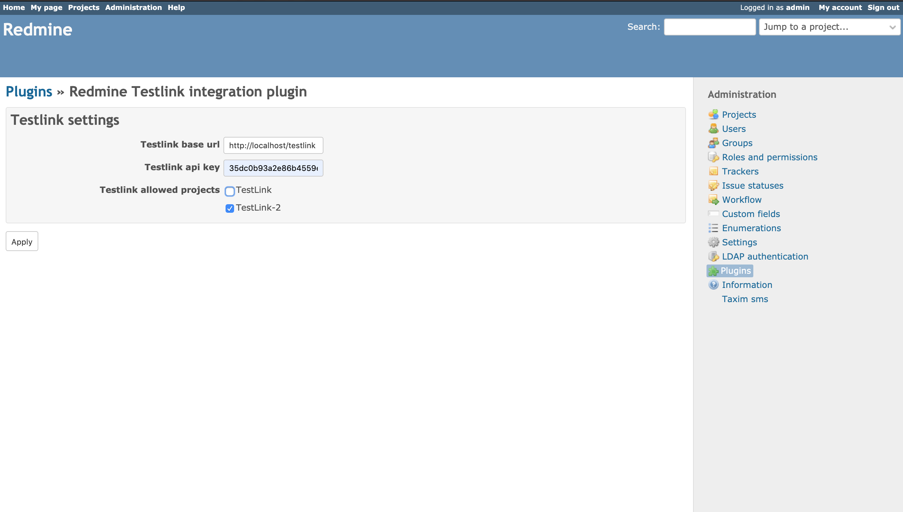
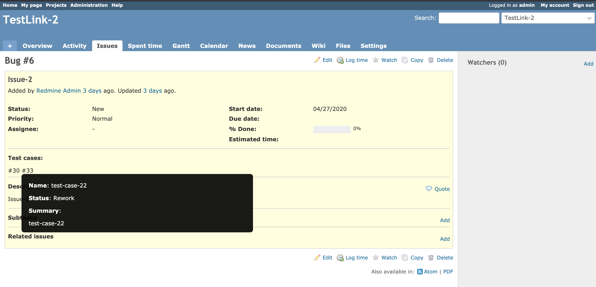

# Redmine Testlink Plugin

This plugin implements integration with TestLink testing system.

Features:
* Test suite export on issue creation.
* Test cases import for issue.
* Ability to set allowed projects for TestLink.

## Installation

1. Download the archive, extract and copy the plugin directory into #{REDMINE_ROOT}/plugins. Note, that
    plugin directory name should be **redmine_testlink**.

2. Install the required gems using the command:

        bundle install

3. Plugin requires migration. Run the following command to upgrade your database:

        bundle exec rake redmine:plugins:migrate RAILS_ENV=production

4. Restart Redmine.

## Usage

### Configure the plugin

Before usage the Redmine Testlink Plugin requires settings configuration. So go to the plugin setting page **Administration > Plugins > Configure**. You will see the plugin settings page.

There are 3 settings parameters:
* **Testlink base url** - base url to TestLink server, example: `http://localhost:8080/`
* **Testlink api key** - TestLink api key (could be found on TestLink profile page)
* **Testlink allowed projects** - the list of projects, where interaction with Testlink will be enabled

### Redmine with Testlink interaction

After configuring auto interaction will be enabled for chosen projects. On issue creation new test suite will be created in project with the same Redmine project, where  issue was created. If project with same name won't be found new one will be created.

Test cases exports automatically per issue on opening issue show page and displaying in issue card. Details available on hover the test case `#id`.

